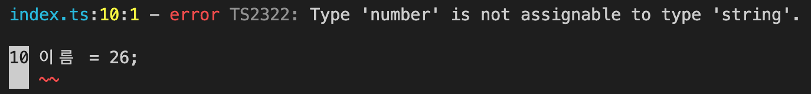
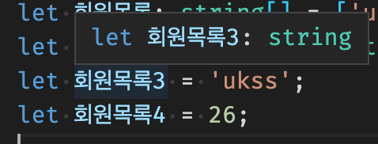

# TypeScript 기본 타입 정리 (primitive types)

> [코딩애플 TypeScript 강의](https://codingapple.com/) 를 보고 참고하여 정리한 내용입니다.

## Table of Contents

- [변수 만들 때 타입 정하기 (타입 실드 씌우기)](#변수-만들-때-타입-정하기-타입-실드-씌우기)
- [여러가지 타입](#여러가지-타입)

### 변수 만들 때 타입 정하기 (타입 실드 씌우기)

타입스크립트는 변수 만들 때 변수의 타입을 지정가능하다
`변수명: 타입`

```tsx
let 이름: string = 'ukss';
```

<b>이름</b>이라는 변수는 string 타입이 되며 숫자 등 string 이 아닌 형태를 할당하려고 하면 에러 발생

### 여러가지 타입

자주 쓰는 primitive types

- string, number, boolean

```tsx
let 이름: string = 'ukss';
let 나이: number = 26;
let 결혼유무: boolean = false;
```

추가로 null, undefined 도 존재 (굳이 사용하지는 않음)

### array 또는 object

array 자료 안에 들어갈 타입은 <b>타입명[]</b> 으로 지정

```tsx
let 회원목록: string[] = ['ukss', 'hong'];
```

object 자료 안에 들어갈 타입은 내가 만들 object와 똑같은 모습으로 지정
변수명 오른쪽에 오는 것들은 전부 타입지정 문법

```tsx
let 회원목록2: { member1: string; member2: string } = { member1: 'ukss', member2: 'hong' };
```

타입을 잘 지정해줄 경우 타입이 실수로 변경될 때 이런 경고성 에러가 발생한다.



### Tip

모든 변수에 타입지정을 하지 않아도 변수 생성시 타입스크립트가 타입을 자동으로 부여해준다.



에러메시지는 tsc-w 명령어 실행중인 터미널에 나온다.

```shell
tsc-w
```
