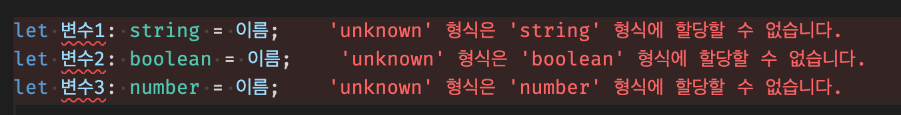

# 타입을 미리 정하기 애매할 경우 (union type, any, unknown)

> [코딩애플 TypeScript 강의](https://codingapple.com/) 를 보고 참고하여 정리한 내용입니다.

## Table of Contents

- [Union Type](#union-type)
- [any](#any)
- [unknown](#unknown)
- [정리](#정리)

### Union Type

OR 연산자 같은 느낌인데 해당 변수에 여러 타입을 정의하고 싶을 때 | 연산자를 사용한다.
전문용어로 <b>Union Type</b>이라고 부른다

```tsx
let 이름: string | number = 'ukss';
let 나이: string | number = 100;
// 괄호를 쳐도 가능하다
```

array, object 자료를 만들 경우

```tsx
var 어레이: (number | string)[] = [1, '2', 3];
var 오브젝트: { data: number | string } = { data: '123' };
```

### any

아무거나 집어넣을 수 있는 타입
쉽게 비유하면 <b>실드해제</b>이다

```tsx
let 이름: any = 'ukss';
이름 = 123;
이름 = undefined;
이름 = [];
```

> 비상시 쓰는 변수 타입체크 해제 기능 용도로 사용할 것 !

### unknown

요즘 타입스크립트는 unknown 타입을 사용한다.
any와 똑같이 모든 타입을 집어넣을 수 있다.

```tsx
let 이름: unknown = 'ukss';
이름 = 123;
이름 = undefined;
이름 = [];
```

중요한 특징

1. unknown 타입엔 모든 자료를 다 집어넣을 수 있다.
2. 자료를 집어넣어도 타입은 그대로 <b>unknown</b>이다.

다음과 같이 다른 변수에 이를 넣으려고 하면 에러가 발생한다.

```tsx
let 이름: unknown;

let 변수1: string = 이름;
let 변수2: boolean = 이름;
let 변수3: number = 이름;
```



(<b>any</b> 는 에러가 발생하지 않는다)

<b>타입스크립트는 정확하고 확실한 것을 좋아한다.</b> 그로 인해 확실하지 않은 타입에는 연산을 수행하지 않는다.
타입스크립트에서는 덧셈, 뺄셈은 number 류의 타입만 할 수 있으며, .name 이런건 object 류의 타입만 할 수 있다고 정의되어있다.

> 뭘 집어놓을지 모르겠는데 약간의 안정성을 도모하고 싶을 경우 <b>unknown</b> 타입을 사용할 것 !

### 정리

unknown 타입인 변수를 조작하려면 내가 조작할 변수의 타입이 무엇인지 확실하게 체크하는 narrowing 또는 assertion 스킬을 사용해야 한다.

변수에 뭐가 들어있을지 애매한, 추측해야하는 상황에서는 반드시 사용해야 함
