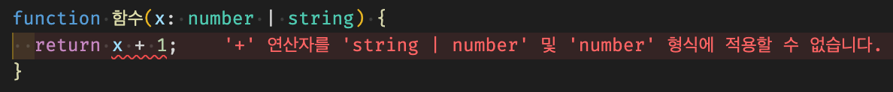

# 함수에 타입 지정하는 방법 & void 타입

> [코딩애플 TypeScript 강의](https://codingapple.com/) 를 보고 참고하여 정리한 내용입니다.

## Table of Contents

- [함수의 기능](#함수의-기능)
- [함수의 타입지정](#함수의-타입지정)
- [void 타입](#void-타입)
- [파라미터가 옵션일 경우](#파라미터가-옵션일-경우)
- [함수도 예외없이 Union Type을 사용할 경우](#함수도-예외없이-union-type을-사용할-경우)

### 함수의 기능

함수는 용도가 긴 코드를 짧게 축약하려고 만든 것도 있지만, 어떤 자료를 입력하면 다른 자료를 출력해주는 기계 역할도 한다.

```tsx
function 함수(x) {
  return x * 2;
}
함수(2); // 4
함수(4); // 8
```

소괄호 안에 들어가는 x 같은 자료를 <b>파라미터</b>라고 부르며, return 오른쪽에 있는 자료들을 <b>리턴값</b>이라고 부른다.

1. 파라미터를 작성해주면 함수를 사용할 때 () 소괄호 안에 아무 자료나 집어넣을 수 있게 되며,
2. 리턴값은 함수가 사용되고 나서 그 자리에 남는 값이다.

### 함수의 타입지정

함수는 총 <b>두 군데</b> 타입지정이 가능하다.

1. 함수로 들어오는 자료 (파라미터)
2. 함수에서 나가는 자료 (return)

```tsx
function 함수(x: number): number {
  return x * 2;
}
```

1. 함수로 들어오는 파라미터 타입지정은 <b>파라미터 옆에 기입</b>
2. 함수가 실행된 후 남는 값(return 우측에 있는 값) 타입지정은 <b>함수명() 우측에 기입</b>

> 파라미터에 타입을 지정하는 <b>필수 파라미터</b>가 된다

### void 타입

함수는 특이하게도 void 타입이 사용가능하다
<b>아무것도 없이 공허함</b>을 뜻하는 타입인데, <b>return 할 자료가 없는 함수의 타입</b>으로 사용이 가능하다.

```tsx
function 함수(x: number): void {
  return x * 2; // ❌ error !
}
```

즉, 함수에 <b>return 방지 장치</b>를 장착하고 싶을 경우 사용

### 파라미터가 옵션일 경우

함수에 파라미터 자리를 만들었지만 가끔 파라미터 없이 사용할 경우도 존재한다.
그럴 경우 타입스크립트에서 해당 파라미터는 옵션이라고 정의를 내려야 에러가 발생하지 않는다.

```tsx
function 함수(x?: number) {}
함수(); // ok
함수(2); // ok
```

그냥 파라미터 우측에 <b>물음표(?)</b> 를 사용하면 된다. 함수()를 사용할 때 파라미터 없이도 사용할 수 있다는 것을 의미한다.
<b>`? === x: number | undefined` </b>

### 함수도 예외없이 Union Type을 사용할 경우

```tsx
function 함수(x: number | string) {
  return x + 1; // ❌ error
}
```



타입스크립트에서는 변수의 타입이 number | string 과 같은 Union Type 인 경우 자료 조작을 금지시킨다.
해당 파라미터의 타입이 확실하지 않으니 파라미터 조작을 막고 금지하는 것이다.

```tsx
function 함수(x?: number): number {
  return x * 2; // ❌ error
}
```

x 라는 파라미터는 **옵션**이며, 해당 파라미터는 number | undefined 와 같은 식의 타입정의가 이뤄진다.
즉, x 라는 파라미터가 확실하지 않기에 에러를 발생
