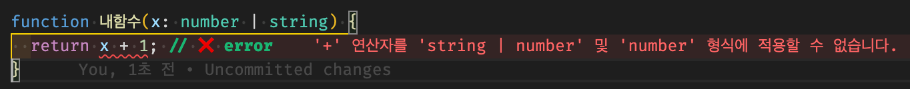

# 타입 확정하기 Narrowing & Assertion

> [코딩애플 TypeScript 강의](https://codingapple.com/) 를 보고 참고하여 정리한 내용입니다.

## Table of Contents

- []()

### 에러 분석

```tsx
function 내함수(x: number | string) {
  return x + 1; // ❌ error
}
```



이는 number | string 같은 union type 에는 일반적으로 조작을 못하게 막아놔서 그렇다.

이는

1. 타입을 하나로 **Narrowing** 해주거나
2. **Assert** 해주거나 둘 중 하나 해주면 된다.

### Type Narrowing

if문 등으로 타입을 하나로 정해주는 것을 의미함

```tsx
function 함수(x: number | string) {
  if (typeof x === 'number') {
    return x + 1;
  } else if (typeof x === 'string') {
    return x + 1;
  } else {
    return 0;
  }
}
```

타입스크립트는 타입이 애매한걸 싫어하기에 꼭 해야함
**타입이 확실하지 않을 때 생기는 부작용을 막기위한 장치 !**

또한 함수 안에서 if문 쓸 때는 마지막에 else{} 없으면 에러가 발생한다.
return 하지 않는 조건문이 존재한다면 추후 버그가 생길 수 있기에 에러를 발생해주는 것이며, 이는

tsconfig.js 에 다음과 같이 추가하면 해결된다.

```json
"noImplicitReturns": false,
```

**굳이 추가하지 말고 엄격하게 쓰자 ⛏️🔨🔧**

> 꼭 typeof를 쓸 필요는 없고 타입을 하나로 확정지을 수 있는 코드라면 어떤 것도 Narrowing 역할을 할 수 있다.<br/>
> in, instanceof 키워드도 사용가능하다

### Type Assertion

타입을 간편하게 assert 할 수 있다.
`변수명 as string`

```tsx
function 함수(x: number | string) {
  return (x as number) + 1;
}
console.log(함수(123));
```

변수명 as number 라고 쓰면, **"나는 해당 변수를 number라고 주장하겠습니다** 라는 뜻이며 실제로 그렇게 타입을 변경해준다.
그러나 이렇게 하기 위해서는 내가 _"해당 함수에 무조건 숫자가 들어올 것이다"_ 라는 사실을 알고 있어야 안전하게 쓸 수 있는 문법이다.

**Q. 만약 함수('123') 과 같이 숫자말고 문자를 입력하게 되면 어떻게 되는가?**

A. as number라고 작성했지만 number 타입처럼 +1 을 해주지는 않는다.
as는 그냥 주장만 하는 것이지 실제로 타입을 바꿔주는 것은 아니다.

```shell
1231
```

as 쓰면 간편하지만 정확히 코드를 짜기 위해서는 narrowing 을 사용하자
as 키워드는 개발자 마음대로 타입을 주장하는 역할이라 엄격한 타입체크 기능을 잠깐 안쓰겠다라는 뜻과 동일하다.

as문법은 다음과 같을 때 사용하자

1. 왜 타입에러가 나는지 정말 모르겠는 상황에 임시로 에러 해결용으로 사용
2. 내가 어떤 타입이 들어올 지 정말 확실하게 알고 있는데 컴파일러 에러가 방해될 경우

추가로 옛날 assertion 문법은 다음과 같다.

```tsx
let 이름: number = 123;

(이름 as string) + 1; //현재문법
<string>이름 + 1; //옛날문법
```

이는 html과 js를 함께 사용하여 개발하는 리액트에서 사용시 html 태그와 헷갈릴 수 있기에 as 키워드를 주로 사용하자
