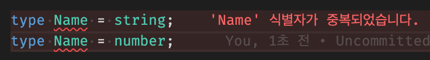

# 타입 변수 선언 (type) & readonly

> [코딩애플 TypeScript 강의](https://codingapple.com/) 를 보고 참고하여 정리한 내용입니다.

## Table of Contents

- [Type Aliases](#type-aliases-변수)
- [Object 타입](#object-타입)
- [readonly](#readonly)
- [속성 몇개가 선택사항일 경우](#속성-몇개가-선택사항일-경우)
- [type 키워드 합치기](#type-키워드-합치기)
- [type 키워드는 재정의가 불가능하다](#type-키워드는-재정의가-불가능하다)

### Type Aliases (변수)

다음과 같이 타입을 나열하는 경우

```tsx
let 동물: string | number | undefined;
```

매우 길고 복잡하게 타입을 나열하는 경우가 많은데, 이게 길고 보기 싫거나 나중에 또 사용하고 싶을 경우 **변수**에 담아서 사용하자

변수 만드는 것처럼 **type**이라는 키워드를 사용하면 된다.
이를 Type Alias 라고 한다.

```tsx
type Animal = string | number | undefined;
let 동물: Animal;
```

**type 타입변수명 = 타입종류**

타입을 변수처럼 만들어서 쓰는 alias 문법이다. 관습적으로 **대문자**로 시작한다.

### Object 타입

```tsx
type 사람 = {
  name: string;
  age: number;
};

let teacher: 사람 = { name: 'john', age: 20 };
```

type 을 사용하지 않은 기본 코드

```tsx
let teacher: {
  name: string;
  age: number;
} = { name: 'john', age: 20 };
```

> 미래의 내가 봤을 때 이해가 어려울 것 같으면 좋은 코드가 아니다.

### readonly

다음과 같이 const 변수를 선언했을 경우이다.

```tsx
const 출생지역 = 'masan';
출생지역 = 'busan'; // const 변수는 여기서 에러남
```

const 변수는 값이 변하지 않는 변수를 만들고 싶을 때 사용한다.
재할당할 경우 에러가 나기에 값이 변하는 걸 미리 감지하고 차단할 수 있다.

그러나 다음과 같이 object 자료를 const 에 넣어도 object 내부는 마음대로 변경이 가능하다.

```tsx
const 여친 = {
  name: 'karina',
};
여친.name = 'winter'; // const 변수지만 에러안남
```

const 변수는 재할당만 막아줄 뿐이지 안에 있는 object 속성 바꾸는 것까지 관여하지 않기 때문이다.

object 속성을 바뀌지 않게 막고 싶으면 **readonly** 를 사용하면 된다.
readonly 키워드는 속성 왼쪽에 붙힐 수 있으며 해당 속성을 변경 불가능하게 막아준다.

```tsx
type Girlfriend = {
  readonly name: string;
};

let 여친: Girlfriend = {
  name: 'karina',
};

여친.name = 'winter'; // readonly라서 에러남
```

### 속성 몇개가 선택사항일 경우

어떤 object 자료가 color, width 속성이 둘 다 필요하지만, 어떤 object 자료는 color 속성이 선택사항일 경우 type alias를 여러개 만들어야 하는게 아닌 물음표(?) 연산자만 추가하면 된다.

```tsx
type Square = {
  color?: string;
  width: number;
};

let 네모2: Square = {
  width: 100,
};
```

물음표(?) 는 **"undefined 라는 타입도 가질 수 있다"** 라는 뜻임을 기억해두자.

### type 키워드 합치기

OR 연산자를 이용해서 Union Type 을 만들 수 있다.

```tsx
type Name = string;
type Age = number;
type NewOne = Name | Age;
```

object에 지정한 타입의 경우도 합치기가 가능하다.
**&** 기호를 사용하면 object 안의 두 개의 속성을 합칠 수 있다.

```tsx
type PositionX = { x: number };
type PositionY = { y: number };
type XandY = PositionX & PositionY;
let 좌표: XandY = { x: 1, y: 2 };
```

Type alias & Type alias 만 가능한 것이 아닌 Type alias & {name : string} 와 같은 형식도 가능하다.

### type 키워드는 재정의가 불가능하다

```tsx
type Name = string;
type Name = number;
```


