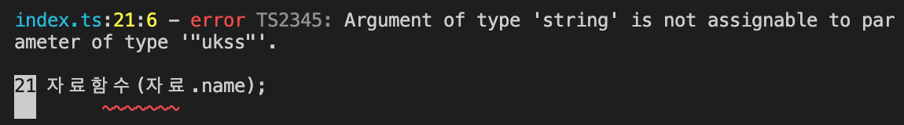

# Literal Types로 만드는 as const 문법

> [코딩애플 TypeScript 강의](https://codingapple.com/) 를 보고 참고하여 정리한 내용입니다.

## Table of Contents

- [Literal Type 만드는 방법](#literal-type-만드는-방법)
- [as const 문법](#as-const-문법)

> 어떤 변수가 미리 골라놓은 데이터만 가질 수 있게 도와주는 역할 !

### Literal Type 만드는 방법

일반 글자같은 것도 타입이 될 수 있다.

```tsx
let ukss: '머리풍성';
let hong: '싱글ㅠ';
```

ukss 라는 변수는 이제 '머리풍성' 이라는 글자만 할당할 수 있다.
hong 라는 변수는 이제 '싱글ㅠ' 이라는 글자만 할당할 수 있다. **(이건 좀 아닌데)**

이와 같이 **특정 글자나 숫자만 가질 수 있게 제한을 두는** 타입을 **Literal Type** 이라고 부른다.

다음과 같이 OR 연산자를 사용해도 된다.

```tsx
let 방향: 'left' | 'right';
방향 = 'left';
```

함수도 똑같다. 다음 예시를 보자
파라미터 타입을 선언할 때 글자나 숫자를 집어 넣으면 해당 값만 파라미터로 넣을 수 있으며,
return 타입 선언할때도 글자나 숫자를 집어 넣으면 해당 값만 return 할 수 있다.

```tsx
function 함수(a: 'hello'): 1 | 0 | -1 {
  return 1;
}

함수('hello');
```

어떻게보면 const 변수의 업그레이드 버전으로 볼 수 있는데, const 변수는 값을 바꿀 수 없는 변수이다.

```tsx
const 불변 = 123;
```

그래서 중요하거나, 변하지 않는 정보를 저장하고 싶을 때는 const를 자주 쓰는데 가끔 변하거나 중요한 정보를 저장하고 싶을 때가 생기면 const 는 무쓸모해진다.

그럴때 다음과 같이 타입스크립트 문법인 Literal Type을 사용하면 된다.

```tsx
const 이름 = 'ukss' | 'hong';
```

### as const 문법

다음과 같은 "ukss" 라는 타입만 들어올 수 있는 함수를 사용하는데, 자료.name 을 입력하고 싶은 경우이다.

```tsx
let 자료 = {
  name: 'ukss',
};

function 자료함수(a: 'ukss') {}

자료함수(자료.name); // ❌ error !
```

다음과 같이 에러가 발생한다.



함수는 "ukss" 타입만 입력할 수 있다고 설정했으며, 자료.name은 string 타입이지 "ukss" 타입이 아니기 때문이다.

다음과 같은 문제를 해결하고 싶을 때는 이와 같이 하면 된다.

1. object 만들 때 타입을 확실하게 정하기
2. assertion 을 사용 (as "ukss")
3. as const 를 사용

다음은 as const 를 사용해서 문제를 해결한 모습이다.

```tsx
let 자료 = {
  name: 'ukss',
} as const;

function 자료함수(a: 'ukss') {}

자료함수(자료.name);
```

as const 는 다음과 같은 속성을 지닌다.

1. 타입을 object의 value로 바꿔준다. (타입을 "ukss" 로 변경)
2. object 안에 있는 모든 속성을 readonly 로 바꿔준다. (변경나면 에러나도록 설정)

> object 를 잠그고 싶다면 **as const** 를 활용해보자 !
