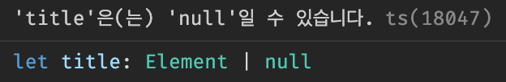
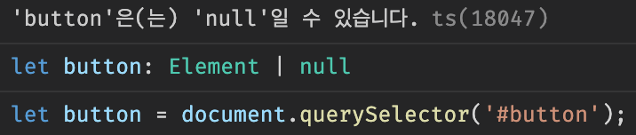

# 타입스크립트로 HTML 변경 및 주의점

> [코딩애플 TypeScript 강의](https://codingapple.com/) 를 보고 참고하여 정리한 내용입니다.

## Table of Contents

- [strictNullCheck](#strictnullcheck)
- [querySelector 오류 분석](#queryselector-오류-분석)
- [a 태그 href 속성 변경](#a-태그-href-속성-변경)
- [button 태그 addEventListener](#button-태그-addeventlistener)

### strictNullCheck

null 이 들어올 경우 체크를 해주는 옵션

tsconfig.json

```json
{
  "compilerOptions": {
    "target": "ES5",
    "module": "commonjs",
    "strictNullChecks": true
  }
}
```

### querySelector 오류 분석

```tsx
let title = document.querySelector('#title');
title.innerHTML = 'Hello';
```



이유는 셀렉터로 html 을 찾으면 타입이 Element | null 이기 때문이다.
(못 찾을 경우 null)

즉, 확실하지 않아서 조작하고 변경하는 것을 금지 시켜주는 것이다.

이는 다음과 같이 해결한다.

```tsx
// 1. Narrowing
let title = document.querySelector('#title');
if (title.innerHTML !== null) {
  title.innerHTML = '반가워요';
}

// 2. instanceof
let title = document.querySelector('#title');
if (title instanceof HTMLElement) {
  title.innerHTML = '반가워요';
}

// 3. assertion
let title = document.querySelector('#title') as HTMLElement;
title.innerHTML = '반가워요';

// 4. optional chaining
let title = document.querySelector('#title');
if (title?.innerHTML !== undefined) {
  title.innerHTML = '반가워요';
}
```

가장 좋은 방법은 2번째에서 사용한 **instanceof** 연산자를 사용하는 것인데, 이를 사용해야 조작가능한 부분이 있기 때문이다.

### a 태그 href 속성 변경

```tsx
let link = document.querySelector('.link');
if (link instanceof HTMLAnchorElement) {
  link.href = 'https://www.kakao.com';
}
```

html 태그 종류별로 정확한 타입명칭이 있다.

- a 태그의 경우 **HTMLAnchorElement**
- img 태그의 경우 **HTMLImageElement**
- h4 태그의 경우 **HTMLHeadingElement**

정확한 타입으로 narrowing 을 해야 html 속성 수정을 제대로 할 수 있다.

### button 태그 addEventListener

다음과 같을 경우 에러가 발생한다.

```tsx
let button = document.querySelector('#button');
button.addEventListener('click', function () {
  alert('메렁어엉ㅇ~');
});
```



이는 버튼이라는 변수가 null 일 수 있기에 위와 같은 오류가 발생한다.

optional chaining 문법으로 이를 해결해보았다.

```tsx
let button = document.querySelector('#button');
button?.addEventListener('click', function () {
  alert('메렁어엉ㅇ~');
});
```

이는 버튼이라는 변수가 없을 경우 해당 자리에 undefined를 보내고, HTMLElement로 잘 있을 경우 addEventListener() 를 부착하기에 이것도 일종의 narrowing 으로 볼 수 있다. 즉 에러 안남 !
