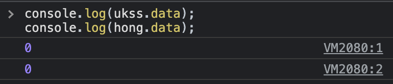
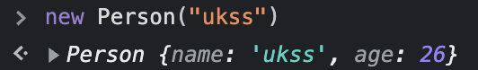

# class 문법 타입지정

> [코딩애플 TypeScript 강의](https://codingapple.com/) 를 보고 참고하여 정리한 내용입니다.

## Table of Contents

- [필드값 타입지정](#필드값-타입지정)
- [constructor 타입지정](#constructor-타입지정)
- [methods 타입지정](#methods-타입지정)

### 필드값 타입지정

class 내부에는 모든 자식 object들이 사용가능한 속성을 만들 수 있다.

다음은 모든 Person 클래스의 자식들에게 data 라는 속성을 부여해주는 코드이다.
class 중괄호안에 위와 같이 변수처럼 만들면 된다. (var, const, let 키워드 X)

```tsx
class Person {
  data = 0;
}

let ukss = new Person();
let hong = new Person();

console.log(ukss.data);
console.log(hong.data);
```



data 라는 속성엔 number 만 들어올 수 있다고 타입지정을 했을 경우

```tsx
class Person {
  data: number = 0;
}

let ukss = new Person();
let hong = new Person();

console.log(ukss.data);
console.log(hong.data);
```

### constructor 타입지정

class는 간단히 말하면 **object 복사기계** 라고 했다.
ES6 신문법에서는 **constructor** 함수를 사용하면 된다.

```tsx
class Person {
  name;
  age;
  constructor(a) {
    this.name = a;
    this.age = 26;
  }
}
```



타입지정 방법
name 속성에 string만, age 속성에는 number만 들어올 수 있게 타입지정

```tsx
class Person {
  name;
  age;
  constructor(a: string, b: number) {
    this.name = a;
    this.age = b;
  }
}
```

constructor 함수는 return 타입지정을 하면 안된다.
constructor에 의해서 항상 object 자료가 생산되기에 생각해보면 의미없다.

필드값이랑 constructor 랑 똑같은 역할을 하지만, new Person()을 사용할 때 **파라미터로 뭔가를 집어넣고 싶으면** constructor로 만들어야 한다.

### methods 타입지정

class 내부에는 함수를 입력할 수 있다.
다음과 같이 제작하면 모든 Person의 자식들은 add 라는 함수를 사용할 수 있다.

```tsx
class Person {
  add(x) {
    console.log(x + 1);
  }
}
```
