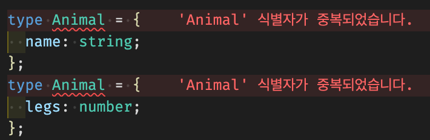
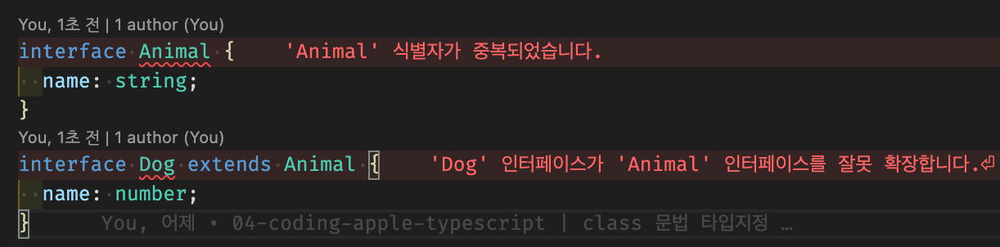
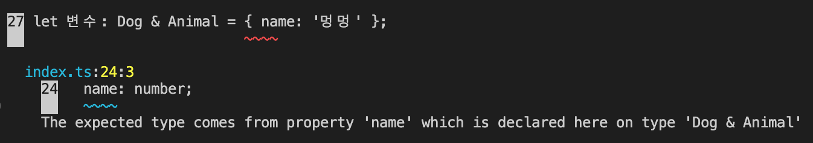

# Interface 타입지정 (Object)

> [코딩애플 TypeScript 강의](https://codingapple.com/) 를 보고 참고하여 정리한 내용입니다.

## Table of Contents

- [Interface 문법](#interface-문법)
- [Interface 장점 - extends](#interface-장점---extends)
- [type 키워드와의 차이점](#type-키워드와의-차이점)
- [타입이름 중복선언의 경우](#타입이름-중복선언의-경우)
- [extend 할 때 object 안의 속성이 중복될 경우](#extend-할-때-object-안의-속성이-중복될-경우)

### Interface 문법

object 자료형의 타입을 미리 정의할 때 사용
interface는 object랑 비슷한 모습으로 작성하면 된다.

```tsx
interface Square {
  color: string;
  width: number;
}

let 네모: Square = { color: 'red', width: 100 };
```

type alias와 용도와 기능이 동일하다.

1. 대문자로 작명
2. {} 안에 타입을 명시

### Interface 장점 - extends

다음과 같은 interface 들이 있다고 가정한다.

```tsx
interface Student {
  name: string;
}
interface Teacher {
  name: string;
  age: number;
}
```

이러한 중복사항들을 extends 문법을 사용해서 줄일 수 있다.
extends 문법은 interface 여기에 복사해달라는 의미이다.

```tsx
interface Student {
  name: string;
}
interface Teacher extends Student {
  age: number;
}
```

Student interface를 extends 해달라고 적으면 Student 안에 있는 속성들을 Teacher에 넣어준다.
즉, Teacher 타입은 age, name 속성을 가지게 된다.

### type 키워드와의 차이점

type alias와 interface는 거의 똑같은 기능을 제공하지만, **차이점은 extends 문법이 약간 다르다는 것**이다.

interface

```tsx
interface Animal {
  name: string;
}
interface Cat extends Animal {
  legs: number;
}
```

type alias
type alias는 extends는 안되고 **&** 기호를 사용해서 object 두개를 합칠 수 있다.

```tsx
type Animal = {
  name: string;
};
type Cat = Animal & { legs: number };
```

interface도 & 기호를 사용해서 복사가 가능하다.

```tsx
interface Student {
  name: string;
}
interface Teacher {
  age: number;
}

let 변수: Student & Teacher = { name: 'ukss', age: 26 };
```

& 기호 쓰는 것을 **intersection** 이라고 부르는데 extends와 유사하게 사용가능하다.

> **주의 ⚠️** <br/>extends를 쓸때 타입끼리 중복속성이 발견될 경우 에러를 띄우지만, &를 사용하면 때에 따라 아닐 수도 있다.

### 타입이름 중복선언의 경우

interface의 경우 타입이름 중복선언을 허용해주며 중복시 extends 한 것이랑 동일하게 동작한다.
그로인해 type 선언을 자주 쓰는 외부 라이브러리 이용시 type 선언을 덮어쓰기, override 하기 편하다.

```tsx
interface Animal {
  name: string;
}
interface Animal {
  legs: number;
}

// Same

interface Animal {
  name: string;
  legs: number;
}
```

type의 경우 중복선언을 허용하지 않습니다 !!

```tsx
type Animal = {
  name: string;
};
type Animal = {
  legs: number;
};
```



일반적인 상황에서는 type 키워드를 자주 활용하면 되는데, **다른 사람이 내 코드를 이용하는 상황이 많으면 interface**로 유연하게 만드는 것이 좋다.
(그래서 타입스크립트로 작성된 라이브러리들은 interface로 타입 정해 놓은 곳이 많다)

혹은 object 자료형은 전부 interface로 만들고 다른 자료형은 type 키워드로 만들고 이런 방식도 괜찮다.
즉, type과 interface 문법을 잘 알고 있으면 기준은 정하기 나름이다.

### extend 할 때 object 안의 속성이 중복될 경우

에러가 발생한다.

```tsx
interface Animal {
  name: string;
}
interface Dog extends Animal {
  name: number;
}
```



& 연산자로 합칠 경우 또한 에러가 발생한다.

```tsx
interface Animal {
  name: string;
}
interface Dog {
  name: number;
}

let 변수: Dog & Animal = { name: '멍멍' };
```



즉 interface든 type키워드든 속성이 중복되면 에러가 발생한다.
