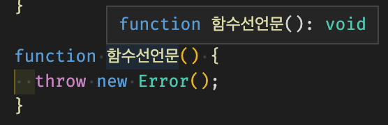
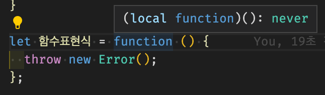
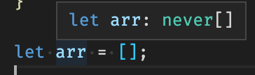

# never 타입

> [코딩애플 TypeScript 강의](https://codingapple.com/) 를 보고 참고하여 정리한 내용입니다.

## Table of Contents

- [Never Type](#never-type)
- [파라미터가 never 타입이 되는 경우](#파라미터가-never-타입이-되는-경우)
- [자동으로 never 타입을 가지는 경우](#자동으로-never-타입을-가지는-경우)

### Never type

함수에 붙이는 return type

```tsx
function 함수(): never {}
```

특이한 조건이 있다.

1. 절대 return을 하면 안된다.
2. 함수 실행이 끝나지 않아야 한다. (전문용어로 endpoint 가 없어야 한다)

조건 1,2는 같은 말인데 모든 JS 함수 맨 밑엔 "return undefined" 라는 숨겨진 코드를 가지고 있다.

즉, 조건 2가 맞으면 1도 맞다.

다음과 같은 함수는 never를 붙일 수 없다.

```tsx
function 함수() {
  console.log(123);
}
```

절대 return을 하지는 않지만 (1), 함수의 실행은 끝나기에 (2) never 을 붙힐 수 없다.

다음과 같은 경우에는 붙일 수 있다.

```tsx
function 함수(): never {
  while (true) {
    console.log(123);
  }
}
```

이는 무한히 실행되기에 (while문이 true로 무한반복) 끝이 안나기에 never 타입을 사용할 수 있다.

다음과 같은 경우에도 붙일 수 있다.

```tsx
function 함수(): never {
  throw new Error('Error Message');
}
```

throw new Error() 문법은 강제로 에러를 내는 기능인데, 에러가 나면 전체 코드 실행이 중단되니 함수 실행이 끝나지 않아야 한다는 2번 조건도 충족하는 것이기에 never를 사용할 수 있다.

그래서 위의 조건 1,2를 만족하는 함수를 표현하고 싶을 때 never 타입을 지정하면 되는데, 조건 2(함수 실행이 끝나지 않아야 함)를 만족하는 함수를 만들 일이 거의 없기에 never 타입은 쓸 일이 거의 없다.

무언가를 return 하고 싶지 않을 경우 void 타입을 이용해도 되며, never는 가끔 **코드를 이상하게 짤 경우 자동으로 등장**하기에 무엇을 의미하는지 이해만 잘 하면 된다.

### 파라미터가 never 타입이 되는 경우

다음 예시를 보자

```tsx
function 함수(parameter: string) {
  if (typeof parameter === 'string') {
    parameter + 1;
  } else {
    parameter;
  }
}
```

narrowing을 이용해서 파라미터의 타입이 string이면으로 조건을 걸었으나 else문이 존재한다. string이 아닐 경우 해달라는 뜻인데 파라미터가 string 밖에 못들어오는 상황에서 이상한 구문으로 볼 수 있다. **즉, 이런 잘못된 narrowing을 사용했을 때 파라미터의 타입이 never로 변한다.**

> 이런건 있을 수 없다, 일어나면 안된다고 알려주는 느낌 !!

### 자동으로 never 타입을 가지는 경우

JS는 함수를 만드는 방법이 2개 있다.

```tsx
function 함수선언문() {
  // default function (함수 선언문)
}

let 함수표현식 = function () {
  // arrow function (함수 표현식)
};
```

아무것도 return 하지 않고 끝나지도 않을 경우 결과

```tsx
function 함수선언문() {
  throw new Error();
} // void

let 함수표현식 = function () {
  throw new Error();
}; // never
```




tsconfig.json에서 strict 옵션을 켜둘 경우 array와 같은 유형 타입지정을 안하고 만들 경우 결과

```tsx
let arr = [];
```



> **쓸 일이 별로 없기에 이러한 경우에도 등장한다고 알아두기 !**
