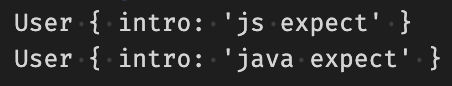

# class에서 사용가능한 protected, static 키워드

> [코딩애플 TypeScript 강의](https://codingapple.com/) 를 보고 참고하여 정리한 내용입니다.

## Table of Contents

- [class는 extends로 복사가 가능하다](#class는-extends로-복사가-가능하다)
- [class 안에서 쓰는 protected 키워드](#class-안에서-쓰는-protected-키워드)
- [class 안에서 쓰는 static 키워드](#class-안에서-쓰는-static-키워드)

### class는 extends로 복사가 가능하다

class는 복사할 수 있다.
**extends**라는 문법을 사용하면 다른 class 만들 때 기존 class에 있던 속성들을 전부 복사할 수 있다.

다음과 같이 extends를 활용하면 NewUser에 User에 있던 속성들을 복사할 수 있다.

```tsx
class User {
  name: 'ukss';
}

class NewUser extends User {
  // User 에 있던 속성 사용가능
}
```

> 기존 class 와 비슷한 class 를 많이 만들어야 할 때 사용

### class 안에서 쓰는 protected 키워드

private랑 비슷하면서도 private이면서 보안을 해제하고 싶을 때 사용한다.

즉 protected를 사용하면

1. private 와 동일
2. extends 된 class 안에서도 사용가능 (private는 불가능)

예시

```tsx
class User = {
  protected x = 10;
}
```

User 라는 class 의 속성은 protected 이며, private와 동일하게 class 안에서만 사용이 가능해지며 User의 자식들도 함부로 사용이 불가능하다.

```tsx
class User {
  protected x = 10;
}

class NewUser extends User {
  doThis() {
    this.x = 20;
  }
}
```

위와 같이 User를 extends하는 NewUser class를 만들 경우 NewUser가 this.x 와 같은 식으로 x를 가져다 쓰려할 경우
x가 private 속성일 경우에는 에러가 발생하지만, **x가 protected 속성일 경우에는 에러가 발생하지 않는다.**

즉 class를 여러개 만들 때 class끼리 공유할 수 있는 속성을 만들고 싶으면 **protected**, class 하나 안에서만 쓸 수 있는 속성을 만들고 싶으면 **private** 를 사용하면 된다.

### class 안에서 쓰는 static 키워드

class {} 안에 집어넣는 변수, 함수 이런건 전부 class로부터 새로 생성되는 object(일명 instance)에 부여된다.
만약 class에 직접 변수나 함수를 부여하고 싶으면 **static** 키워드를 왼쪽에 붙이면 된다.

```tsx
// 기본
class User {
  x = 10;
  y = 20;
}

let john = new User();
john.x; // 가능
User.x; // 불가능

// static
class User {
  static x = 10;
  y = 20;
}

let john = new User();
john.x; // 불가능
User.x; // 가능
```

- 함수도 static 붙일 수 있다.
- extends로 class를 복사할 경우 static 붙은 것들도 따라온다.

**Q. static 은 언제 사용하는가?**

주로 class 안에 간단한 메모를 하거나, 기본 설정값을 입력하거나 class로 부터 생성되는 object가 사용할 필요가 없는 변수들을 만들어 놓고 싶을 때 사용한다.

예시

```tsx
class User {
  static skill = 'js';
  intro = User.skill + 'expect';
}

let ukss = new User();
console.log(ukss);
```

1. User 클래스 생성
2. 자식들에게 {intro : 'js expect'} 를 복사해주고 싶음
3. js 라는 단어를 따로 static skill 에 저장하여 이를 사용
4. 자식들은 ukss.intro 를 사용하면 'js expect' 메시지를 출력한다.

skill 을 변경하고 싶을 경우 다음과 같이 활용할 수 있다.

```tsx
class User {
  static skill = 'js';
  intro = User.skill + 'expect';
}

let ukss = new User();
console.log(ukss);

User.skill = 'java';
let hong = new User();
console.log(hong);
```



이렇게 class 내부의 기본 변수들을 수정할 수는 있지만, 보다 안전하기 위해서는 pricate를 사용 후 그 다음에 수정함수를 만들어서 사용하는 것이 좋다.
