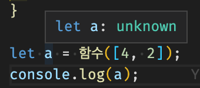
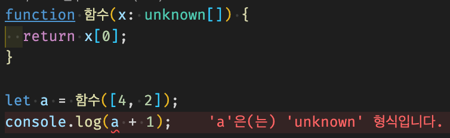
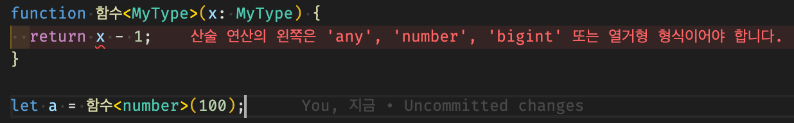
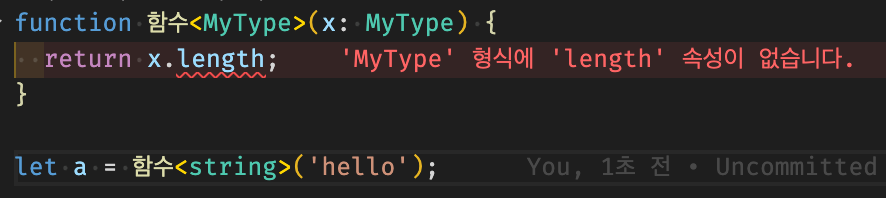
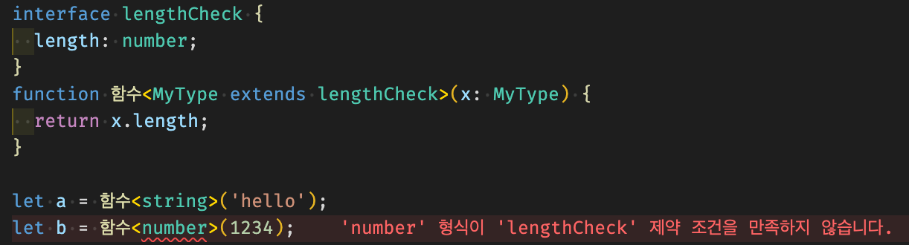

# 타입을 파라미터로 입력하는 Generic

> [코딩애플 TypeScript 강의](https://codingapple.com/) 를 보고 참고하여 정리한 내용입니다.

## Table of Contents

- [함수 return 값의 타입이 애매하면](#함수-return-값의-타입이-애매하면)
- [Generic 적용한 함수 제작](#generic-적용한-함수-제작)
- [에러 분석](#에러-분석)
- [Generic 타입 제한하기 (Constraints)](#generic-타입-제한하기-constraints)
- [커스텀 타입 extends](#커스텀-타입-extends)

타입스크립트를 사용하면 파라미터로 타입을 입력할 수 있다.
<> 안에 타입을 넣으면 되는 방식이다.

### 함수 return 값의 타입이 애매하면

만약 아무렇게나 생긴 array 자료를 입력하거나, array의 첫 자료를 그대로 출력해주는 함수를 만들었을 경우이다.

```tsx
function 함수(x: unknown[]) {
  return x[0];
}

let a = 함수([4, 2]);
console.log(a);
```

다음과 같이 a 의 타입을 확인해보면 숫자는 아니고 **unknown** 타입이다.



왜냐하면 **지금 입력하는 array도 unknown 타입이기 때문**이다.

여기서 중요포인트는 **타입스크립트는 타입을 알아서 변경해주지 않는다** 는 것입니다.

```tsx
function 함수(x: unknown[]) {
  return x[0];
}

let a = 함수([4, 2]);
console.log(a + 1);
```

다음과 같이 에러가 발생한다.



a 는 사람이 보기에 분명히 숫자가 맞지만 타입은 아직 unknown 타입이기 때문이다.
직접 함수의 return 타입지정을 :number와 같이 강제로 변경하기 전까지는 number 타입으로 변하지 않는다.

이로 인해 함수에 불확실한 unknown, any, union 타입을 입력하면 나오는 값도 unknown, any, union 타입이고, 이로 인해 발생하는 문제들이 많다.
e.g. 함수가 10을 return 하는데 타입이 unknown 이라 조작을 하지 못함

해결책으로는 narrowing 을 하면 되는데, 이는 번거로운 편이며 이를 처음부터 타입을 파라미터로 함수에 미리 입력하는 방법도 있다. 이렇게 할 경우 원하는 곳에 가변적으로 타입지정이 가능하다. 이를 **Generic** 이라고 부른다.

### Generic 적용한 함수 제작

함수에 <> 를 사용하면 파라미터를 또 입력할 수 있다. 다만 여기 안에는 타입만 입력할 수 있다.

```tsx
function 함수<MyType>(x: MyType[]): MyType {
  return x[0];
}

let a = 함수<number>([4, 2]);
let b = 함수<string>(['ukss', 'hong']);
```

위와 같이 함수를 사용할 때도 <> 를 사용하면 파라미터처럼 타입을 입력할 수 있다.
함수<number>() 라고 작성하면 MyType 이라는 변수에 number 라는게 들어간다고 볼 수 있다.

**즉, 함수(x:number[]):number{} 와 똑같이 동작한다.**

결론은 Generic을 쓰면 우리가 정한 타입을 return 값으로 뱉는 함수를 제작할 수 있게된다.

```tsx
function 함수<MyType>(x: MyType[]): MyType {
  return x[0];
}

let a = 함수([4, 2]);
let b = 함수(['ukss', 'hong']);
```

위와 같이 함수 사용시 꼭 <> 안써도 알아서 기본 타입을 유추해서 집어넣어 준다. 즉, 결과는 동일하다.

> - 타입 파라미터는 자유롭게 작명이 가능하다. 보통 <T> 이런걸로 많이 사용한다.
> - 일반 함수 파라미터 처럼 2개 이상 넣기도 가능하다.

### 에러 분석

다음 코드는 에러가 발생한다.

```tsx
function 함수<MyType>(x: MyType) {
  return x - 1;
}

let a = 함수<number>(100);
```



`<MyType>`에 number 가 아닌 다른 타입이 들어올 수 있으니 해당 오류를 발생시켰다.

해결 방법으로 narrowing을 해도 되나 MyType에 집어넣을 수 있는 타입을 미리 제한하는 것도 하나의 해결책이다.

### Generic 타입 제한하기 (Constraints)

extends 문법을 사용하면 넣을 수 있는 타입을 제한할 수 있다.
**MyType extends number** 라고 쓰면 타입 파라미터에 넣을 수 있는 타입을 제한할 수 있다.

interface 문법에 쓰는 extends와 살짝 다른 느낌이며, 해당 extends는 복사보단 선언한 타입과 비슷한 속성을 가지고 있는지 if 문으로 체크하는 문법으로 보면 된다.

```tsx
function 함수<MyType extends number>(x: MyType) {
  return x - 1;
}

let a = 함수<number>(100); // OK
```

### 커스텀 타입 extends

문자로 파라미터를 넣으면 자릿수를 세어서 출력해주는 함수를 Generic으로 만드는 함수이다.

```tsx
function 함수<MyType>(x: MyType) {
  return x.length;
}

let a = 함수<string>('hello');
```



에러가 발생하는데 이는 MyType에 어떤 타입이 들어올 지 애매한 상황이기에 우선 length 와 같은 조작을 방지해주는 것이다.

그래서 이를 extends로 확실하게 타입을 지정해주면 되는데 다음은 interface로 만들어둔 타입을 extends 하는 코드이다.

```tsx
interface lengthCheck {
  length: number;
}
function 함수<MyType extends lengthCheck>(x: MyType) {
  return x.length;
}

let a = 함수<string>('hello');
let a = 함수<number>(1234); // Error !
```



> class도 class <MyType> {} 와 같은 방식으로 만들면 new로 뽑을 때 타입 파라미터를 집어넣을 수 있다.
> type Age<MyType> = MyType 이러한 식으로 타입변수에도 사용 가능하다.
