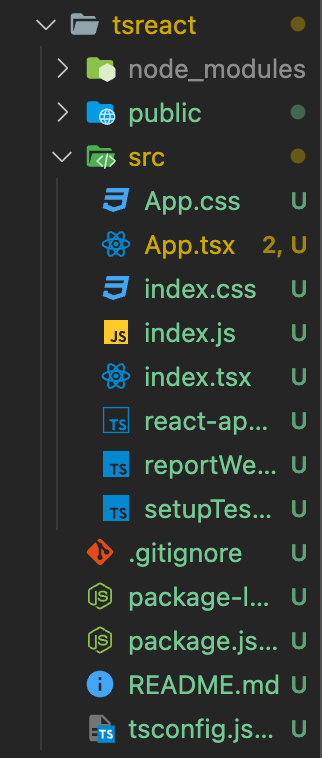

# React + Typescript 1

> [코딩애플 TypeScript 강의](https://codingapple.com/) 를 보고 참고하여 정리한 내용입니다.

## Table of Contents

- [고려해야 할 사항](#고려해야-할-사항)
- [React + Typescript](#react--typescript)
- [React + TS 타입지정](#react--ts-타입지정)
  - [1. 일반 변수, 함수 타입지정](#1-일반-변수-함수-타입지정)
  - [2. JSX 타입지정](#2-jsx-타입지정)
  - [3. function component 타입지정](#3-function-component-타입지정)
  - [4. state 문법 사용시 타입지정](#4-state-문법-사용시-타입지정)
  - [5. type assertion 문법 사용할때](#5-type-assertion-문법-사용할때)
- [결론](#결론)

### 고려해야 할 사항

기존 프로젝트에 타입스크립트와 같은 방식을 도입하려면, 요즘 유행이라고 따라하지말고 이득을 따져보아야 한다.

- 프로젝트 사이즈가 큰가
- 협업시 다른 사람이 짠 코드를 참조할 일이 많은가
- 장기적으로 유지보수에 도움이 되는가
- 나중에 팀원이 더 필요해도 인력수급이 쉽게 가능한가
- 팀원들 학습에 필요한 시가노가 비용이 적게 드는가

등, 이러한 질문을 해보고 Yes 가 많을 경우 도입해도 된다.

사실 요즘은 거의 필수 스택이며 타입스크립트는 애초에 에디터의 부가기능이다. 즉 열심히 쓰자 !

### React + Typescript

React + TS 개발환경 구축

새로 프로젝트를 시작할 경우

```shell
npx create-react-app 프로젝트명 --template typescript
```

기존 프로젝트에 타입스크립트만 더하고 싶은 경우, 기존 프로젝트 경로에서 터미널을 오픈한 후

```shell
npm install --save typescript @types/node @types/react @types/react-dom @types/jest
```

이후 .js 파일을 .ts 파일로 바꿔서 이용가능하다.

프로젝트의 구성은 다음과 같다.


(필요없는 파일은 지운 상태이다)

기존 프로젝트와 다른 점은 컴포넌트 파일은 js 가 아니라 **tsx** 로 확장자를 사용해야 한다는 것이다. ts 랑 동일하지만 jsx 문법을 지원한다.

즉, 코드를 짜는 것은 일반 리액트와 큰 다른점이 없다.

다만 차이점은 **함수, 컴포넌트, state, props 타입체크**를 잘해야 에러가 발생하지 않는다.

### React + TS 타입지정

#### 1. 일반 변수, 함수 타입지정

타입스크립트 배웠던 것이랑 동일

#### 2. JSX 타입지정

리액트에서는 변수나 자료에 `<div></div>` 와 같이 HTML 문법을 쌩으로 담아서 쓸 수 있다.
이는 리액트에서 HTML이 아니라 **JSX**라고 부르는 자료가 된다.

이러한 자료를 타입지정하고 싶으면 **JSX.Element** 라는 타입을 쓰면 된다.

```tsx
let 박스: JSX.Element = <div></div>;
let 버튼: JSX.Element = <button></button>;
```

#### 3. function component 타입지정

리액트의 컴포넌트는 다음과 같이 생겼다.

```tsx
function App() {
  return <div>반갑다이</div>;
}
```

컴포넌트 타입지정은 당연히 함수이니 **파라미터와 return 타입지정**을 하면된다.

파라미터는 항상 props 이기 때문에 props 가 어떻게 생겼는지 조사해서 타입을 지정하면 되며, return 타입은 컴포넌트가 JSX 를 return 하기에 JSX.Element 로 써주면 된다.
(JSX.Element 는 생략해도 자동으로 타입지정된다.)

```tsx
type AppProps = {
  name: string;
};

function App(props: AppProps): JSX.Element {
  return <div>{message}</div>;
}
```

props 로 JSX 를 입력할 수 있게 코드를 짜는 경우도 있다. 이는 **JSX.IntrinsicElements** 라는 이름의 타입을 사용하면 된다.

이는 `<div>, <a> <h4>` 와 같은 기본 태그들을 표현해주는 타입이며 해당 컴포넌트에 타입을 넣고 싶으면 다음과 같이 하면 된다.

```tsx
// Default
<Container a={<h4>반가워유</h4>} />;

function Container(props) {
  return <div>{props.a}</div>;
}

// JSX.IntrinsicElements
type ContainerProps = {
  a: JSX.IntrinsicElements['h4'];
};

function Container(props: ContainerProps) {
  return <div>{props.a}</div>;
}
```

즉, 이는 a 라는 props 자리에 `<h4>` 만 넣을 수 있게 타입쉴드를 씌워놓은 것이다.

> 참고로 리액트 18버전부터 JSX.IntrinsicElements는 props 타입넣을 때만 사용이 가능하다.

#### 4. state 문법 사용시 타입지정

state 만들 땐 자동으로 타입이 할당되어 걱정할 필요가 없다. 만약 state 타입이 나중에 변화할 수 있을 경우 그럴 경우에는 미리 지정을 하면 된다.

<> 열고 타입을 넣으면 된다. (Generic 문법)

```tsx
const [user, setUser] = useState<string | null>('ukss');
```

#### 5. type assertion 문법 사용할때

assertion 하고 싶을 경우 as 혹은 <> 를 사용하면 되는데, 리액트에서 컴포넌트로 오해할 수 있어 <> 는 리액트에서 사용하지 않는다.
**as 키워드만 사용하자**

하지만 as 키워드는 타입스크립트 보안해제이기에 타입이 100% 확실할 때만 사용하자.

```tsx
let code: any = 123;
let employeeCode = <number>code; // 부적절 !!
```

### 결론

타입스크립트를 쓴다고 리액트 개발방식이 달라지는게 아니라 함수, 변수 정의부분을 타입지정할 수 있다는 것만 달라진다.

"props에는 무조건 {name: string}만 들어올 수 있다" 와 같은 문법을 작성하는 것이 끝이며 그냥 에디터 부가기능 수준으로 보면 된다.
