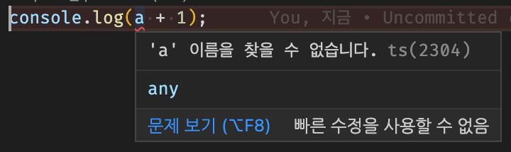

# declare, ambient

> [코딩애플 TypeScript 강의](https://codingapple.com/) 를 보고 참고하여 정리한 내용입니다.

## Table of Contents

- [외부 JS 파일을 사용하는 경우 발생하는 일](#외부-js-파일을-사용하는-경우-발생하는-일)
- [declare 키워드로 재정의](#declare-키워드로-재정의)
- [Ambient Module](#ambient-module)
- [declare global](#declare-global)

### 외부 JS 파일을 사용하는 경우 발생하는 일

외부 JS 파일을 이용하는 경우 import 문법으로 가져다 사용하면 되는데, 해당 파일이 TS 가 아닌 JS 로 작성된 파일이면 타입지정이 안되어 있기에 무수한 에러가 발생할 수 있다.

index.ts 에서 data.js 에 있는 a 라는 변수를 사용하기 위해선 다음과 같이 한다.

```tsx
// data.js
let a = 10;
let b = { name: 'ukss' };

// index.ts
console.log(a + 1);
```

```html
<!-- index.html -->

<script src="data.js"></script>
<script src="index.js"></script>
```

콘솔창에는 11 이 잘나오지만, TS 파일에서는 a 가 정의되지 않았다고 에러가 발생한다.




왜냐하면 `<script>` 태그로 JS 파일 2개 연결해서 사용하는 것은 html 의 입장이고 ts 입장에서는 a 라는 변수를 import 한 적이 없기에 에러가 발생하는 것이다.

### declare 키워드로 재정의

declare 를 사용하면 이미 정의된 변수나 함수를 재정의할 수 있다. 타입도 포함해서 재정의가 가능하다.

declare 우측에 정의할 변수를 집어넣으면 된다.

```tsx
// data.js
let a = 10;
let b = { name: 'ukss' };

// index.ts
declare let a: number;
console.log(a + 1);
```

"a 라는 변수를 해당 파일에서 잠깐 정의해주세요" 라는 뜻인데, 즉 **"a 라는 변수는 분명 어딘가에 있으니 에러를 발생시키지 마라"** 로 보면된다.

그래서 JS 파일 변수를 가져다 쓰는데 **타입 에러나 변수 없다와 같은 에러를 방지**하고 싶으면 **declare 키워드**를 쓰자

> declare 붙은 코드들은 JS 로 변환되지 않는다. 그냥 컴파일러에게 힌트를 주는 역할의 코드라 그러하다.

JS 로만 작성된 외부 라이브러리들을 쓸 때도 유용하다. TS 버전이 없다면 직접 declare 로 타입작성하면 된다.

TS 파일들은 변수 만들때 타입 까먹어도 자동으로 타입지정이 되어있으니 굳이 쓸 이유는 없다.

만일 tsconfig.json 안에 allowJs 옵션을 true 로 켜두면 JS 파일도 타입지정이 알아서 implicit 하게 된다. React 같은 프로젝트에서 유용하게 쓸 수 있다.

**Q. .ts 파일에 있던 변수를 .ts 파일에서 쓰고 싶을 경우 declare 가 필요한가?**

TS 파일은 그냥 import, export 문법을 사용하면 된다 !

### Ambient Module

TS 는 import, export 없이도 타입들을 다른 파일에서 가져다 쓸 수 있는 기능이 있다. 즉, a.ts 에 있던 변수나 타입정의를 b.ts 에서도 아무 설정없이 그냥 가져다 쓸 수 있다.

```tsx
// data.ts
type Age = number;
let 나이: Age = 20;

// index.ts
console.log(나이 + 1); // OK
let 민수: Age = 30; // OK
```

왜냐하면 ts 파일에 입력한 변수와 타입들은 전부 **global 변수** 취급을 받는다. 즉 이렇게 전역으로 쓸 수 있는 파일을 전문용어로 **ambient module** 이라고 칭한다.
(ts 에서 `let name` 이라는 이름의 변수생성이 안되는 이유, 어디선가 기본으로 `let name` 을 이미 쓰고 있기 때문)

반면 import 혹은 export 키워드가 들어간 ts 파일은 다르다.

**import / export 키워드가 적어도 하나 있으면** 해당 파일은 로컬 모듈이 되며, 거기 있는 모든 변수는 export 를 해야 다른 파일에서 사용할 수 있다.

즉, ts 파일이 다른 파일에 영향을 끼치는 걸 막고 싶으면 **export 키워드** 를 강제로 추가하면 된다.

```tsx
// data.ts
export {};
type Age = number;
let 나이: Age = 20;

// index.ts
console.log(나이 + 1); // Error ! "나이" 라는 변수를 찾을 수 없음
let 민수: Age = 30; // Error ! "Age" 라는 타입을 찾을 수 없음
```

이를 통해 data.ts 에 있던 파일은 더 이상 글로벌 모듈 (ambient module) 이 되지 않으며 다른 파일에서 함부로 가져다 쓸 수 없다. 이를 사용하려면 import, export 를 사용해야 한다.

### declare global

ts 파일에 import, export 문법이 없으면 글로벌 모듈이 된다. 반면 import, export 문법이 있으면 로컬 모듈이 된다.

로컬 모듈에서 갑자기 전역으로 변수를 만들어야 할 경우 declare 를 붙여서 만들면 된다.

```tsx
declare global {
  type Dog = string;
}
```

일종의 **namespace 문법** 인데 global 이라는 이름의 namespace 에 추가된다고 보면 된다.

global namespace 는 모든 파일에서 기본적으로 이용이 가능하여 로컬 모듈에서 전역변수 만들고 싶을 때 사용하면 된다.
