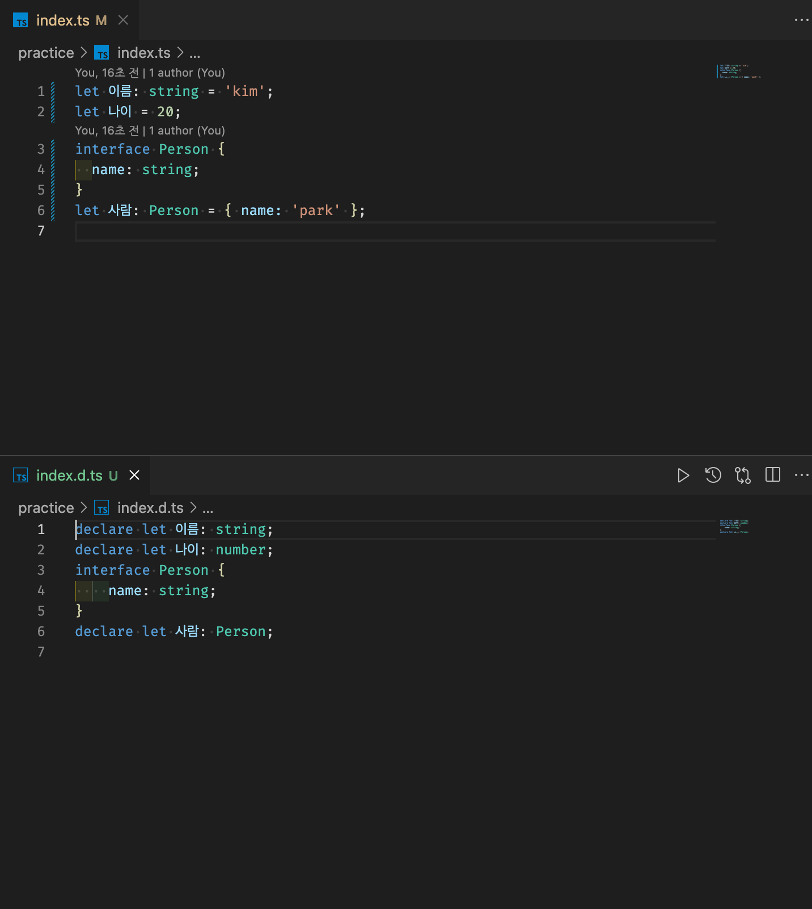
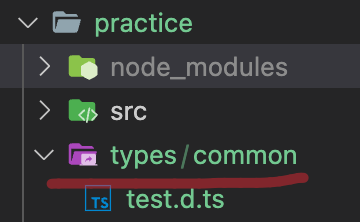

# d.ts 파일 이용하기

> [코딩애플 TypeScript 강의](https://codingapple.com/) 를 보고 참고하여 정리한 내용입니다.

## Table of Contents

- [d.ts](#dts)
- [타입만 따로 d.ts 에 모아놓으려면](#타입만-따로-dts-에-모아놓으려면)
- [d.ts 파일을 레퍼런스용으로 사용하려면](#dts-파일을-레퍼런스용으로-사용하려면)
- [export 없이 d.ts 파일을 글로벌 모듈 만들기](#export-없이-dts-파일을-글로벌-모듈-만들기)
- [유명 JS 라이브러리들의 d.ts](#유명-js-라이브러리들의-dts)

### d.ts

해당 파일은 **타입만 저장할 수 있는 파일형식** 이다. (그래서 definition 의 약자인 d 가 들어간다.)

해당 파일은 JS로 컴파일되지 않는다.

용도는 다음과 같다.

1. 타입정의만 따로 저장해놓고 import 해서 사용하려고
2. 프로젝트에서 사용하는 타입을 쭉 정리해놓을 레퍼런스용으로 사용

### 타입만 따로 d.ts 에 모아놓으려면

1. OOO.d.ts 라고 작성한 파일은 **타입 정의만** 넣을 수 있다. (e.g. type, interface)

함수의 경우 함수에 {} 중괄호 붙이기는 불가능하다. 파라미터 & return 타입만 지정가능하다.

```tsx
export type Age = number;
export type Multiply = (x: number, y: number) => number;
export interface Person {
  name: string;
}
```

2. 정의해둔 타입은 export 해서 써야한다.

d.ts 파일은 ts 파일이 아니기 때문에 그냥 써도 ambient module 이 되지 않는다. 그래서 export 를 추가해줘야 다른 ts 파일에서 가져다 쓸 수 있다.

3. 한 번에 많은 타입을 export 하고 싶은 경우

- namespace 에 담아 사용
- import \* as OOO 문법 사용

### d.ts 파일을 레퍼런스용으로 사용하려면

ts 파일마다 d.ts 파일을 자동생성하면 된다.

tsconfig.json 에서 `"declaration": true` 로 설정해준다.

```json
{
  "compilerOptions": {
    "target": "es5",
    "module": "es6",
    "declaration": true // 저장시 자동으로 ts 파일마다 d.ts 파일 생성
  }
}
```

다음과 같이 자동으로 d.ts 파일이 생성된 모습이다.



**즉 OOO.d.ts 라는 파일에는 OOO.ts 파일에 있는 모든 변수와 함수 타입정의가 들어있다.**

자동생성의 경우 따로 수정하거나 작성할 수 없어 레퍼런스용으로 사용하면 된다. (수정해도 자동생성이라 의미가 없음)

### export 없이 d.ts 파일을 글로벌 모듈 만들기

d.ts 파일은 import, export 가 없어도 **로컬 모듈** 이다.

그래서 다른 ts 파일에서 import 를 해서 쓸 수 밖에 없는데 이를 글로벌 모듈로 만들 수 있다.

1. 프로젝트 내에 types/common 폴더 구조를 만든다.



2. tsconfig.json 파일에 **"typeRoots": ["./types"]** 옵션 추가

ts 파일 작성할 때 타입이 없으면 자동으로 설정한 경로에서 타입을 찾아서 적용해준다.

```json
{
  "compilerOptions": {
    "target": "ES6",
    "module": "ES2015",
    "strictNullChecks": true,
    ...
    "typeRoots": ["./types"]
  }
}
```

- 다만 이걸 쓸 경우 d.ts 자동저장 기능을 끄는 것이 좋다 ("declaration": false)
- d.ts 파일명은 기존 ts 파일명과 안겹치게 작성하는 것이 좋다.

> 해당 기법을 사용하다 로컬 타입과 글로벌 타입이 겹칠 수 있기에 안전한 import, export 를 사용하자.

### 유명 JS 라이브러리들의 d.ts

1. 라이브러리 타입정의 파일 저장소
   [DefinitelyTyped](https://github.com/DefinitelyTyped/DefinitelyTyped)
2. 타입이 정의된 npm 패키지 찾기
   [TypeSearch](https://www.typescriptlang.org/dt/search?search=)
3. 타입부분만 따로 설치
   e.g. 타입파일이 제공되지 않는 jquery 같은 경우
   ```shell
   npm install --save @types/jquery
   ```
