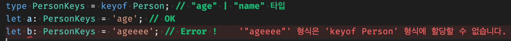

# object 타입 변환기 만들기

> [코딩애플 TypeScript 강의](https://codingapple.com/) 를 보고 참고하여 정리한 내용입니다.

## Table of Contents

- [keyof 연산자](#keyof-연산자)
- [Mapped Types](#mapped-types)

### keyof 연산자

keyof 는 object 타입에 사용하면 **object 타입이 가지고 있는 모든 key 값을 union type 으로 합쳐서 내보내준다.**

object 의 key 를 뽑아서 새로운 타입을 만들고 싶을 때 사용하는 연산자이다.

```tsx
interface Person {
  age: number;
  name: string;
}

type PersonKeys = keyof Person; // "age" | "name" 타입
let a: PersonKeys = 'age'; // OK
let b: PersonKeys = 'ageeee'; // Error !
```

keyof 를 사용해서 PersonKeys 는 Person 타입에 있던 age, name key 를 통해 "age" | "name" 타입이 된다.



Person 타입은 모든 문자 key 를 가질 수 있기에 keyof Person 을 사용하면 key 값이 string 타입이 된다.
사실 **string | number 타입** 인데, 이는 object key 값에 숫자를 넣어도 문자로 치환되기 때문이다.

[key :number] 와 같이 숫자만 들어올 수 있다고 해놓으면 key 값이 number 타입이 된다.

> 참고로 JS는 .keys() 를 붙이면 key 값을 array 자료로 담아준다.

### Mapped Types

object 안에 있는 속성들을 다른 타입으로 한번에 변환할 때 사용

**[자유작명 in keyof 타입파라미터] : 원하는 타입**

in 키워드는 왼쪽이 오른쪽에 들어있냐라는 뜻이며, keyof 는 object 타입에서 key 값만 union type 으로 뽑아주는 역할이다.

```tsx
type Car = {
  color: boolean;
  model: boolean;
  price: boolean | number;
};

type TypeChanger<MyType> = {
  [key in keyof MyType]: string;
};

type NewType = TypeChanger<Car>;

let obj: NewType = {
  color: 'black',
  model: 'benz',
  price: '6000',
};
```

이렇게 하면 NewType 은 color, model, price 속성을 가지고 있으며 모두 string 타입이 된다.

key 값이 무수히 많은 object 타입을 변경할 일이 있으면 쓰도록 하자.
