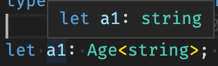
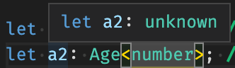

# 조건문으로 타입만들기 & infer

> [코딩애플 TypeScript 강의](https://codingapple.com/) 를 보고 참고하여 정리한 내용입니다.

## Table of Contents

- [삼항연산자](#삼항연산자)
- [조건부로 타입만들기](#조건부로-타입만들기)
- [infer 키워드](#infer-키워드)

### 삼항연산자

JS 기본 문법으로 간략하게 if 문을 만들 수 있는 문법

**조건 ? 참일때 실행 : 거짓일 때 실행**

```tsx
3 > 1 ? console.log('참') : console.log('거짓');
```

### 조건부로 타입만들기

이렇게 타입을 넣을 수 있다.

```tsx
type Age<T> = T;

let test: Age<string>; // test 는 string 타입
```

이를 조건부로 타입을 만들 수 있는데 만약 타입 파라미터 자리에 string 타입을 집어넣으면 string 타입을 부여하고, 그게 아니면 unknown 처리하고 싶을 경우 **if문**을 사용하면 된다.

다만 해당 조건에서 if 문은 사용할 수 없어 **삼항 연산자**로 이를 구현하면 된다.

타입 조건식은 주로 **extends 키워드와 삼항연산자**를 이용한다. extends는 **왼쪽이 오른쪽의 성질을 가지고 있냐**라는 뜻으로 사용할 수 있기에 조건식 용도로 사용이 가능하다.

```tsx
type Age<T> = T extends string ? string : unknown;
// T 라는 파라미터가 string 성질을 가지고 있느냐?
// 참이면 string
// 거짓이면 unknown

let a1: Age<string>; // string
let a2: Age<number>; // unknown
```




### infer 키워드

infer 키워드는 입력한 타입을 변수로 만들어주는 키워드이다.

```tsx
type Person<T> = T extends infer R ? R : unknown;
type NewType = Person<string>; // string
```

1. infer 키워드는 조건문 안에서만 사용할 수 있다.

2. infer 우측에 자유롭게 작명하면 타입을 T에서 유추해서 R이라는 변수에 집어넣어라는 뜻이다.즉 타입 피라미터 자리에 string 을 집어넣으면 R 은 string 이 된다.

3. R 을 조건식 안에서 맘대로 사용할 수 있다.

즉 **타입 파라미터에서 타입을 추출해서** 쓰고싶을 때 사용하는 키워드

사용 용도

1. array 안에 있던 타입이 어떤 타입인지 뽑아서 변수로 만들 수 있다.

```tsx
type GetType<T> = T extends (infer R)[] ? R : unknown;
type NewType = GetType<boolean[]>; // NewType => boolean
```

2. 함수의 return 타입이 어떤 타입인지 뽑아서 변수로 만들 수 있다.

```tsx
type GetType<T> = T extends () => infer R ? R : unknown;
type NewType = GetType<() => number>; // NewType => number
```

**규칙이 있다기 보다는 그냥 타입을 추출하는 식으로 이해할 것**

> 참고로 `ReturnType<>` 이라는 예약 타입이 있는데, 함수 타입을 집어넣으면 return 타입만 뽑아서 알려주는 타입이다.
